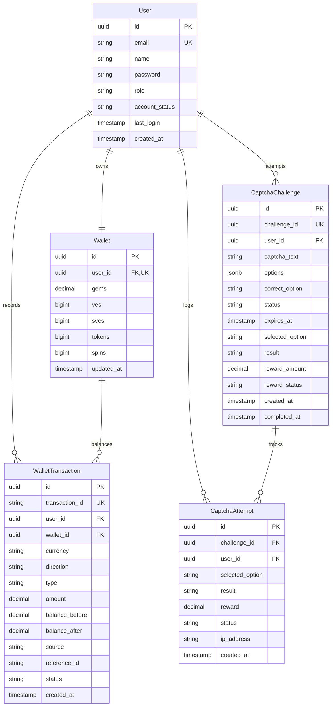
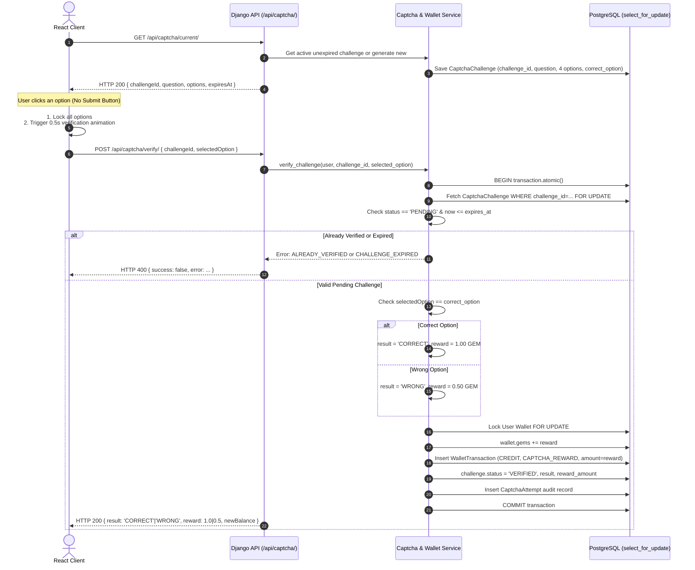
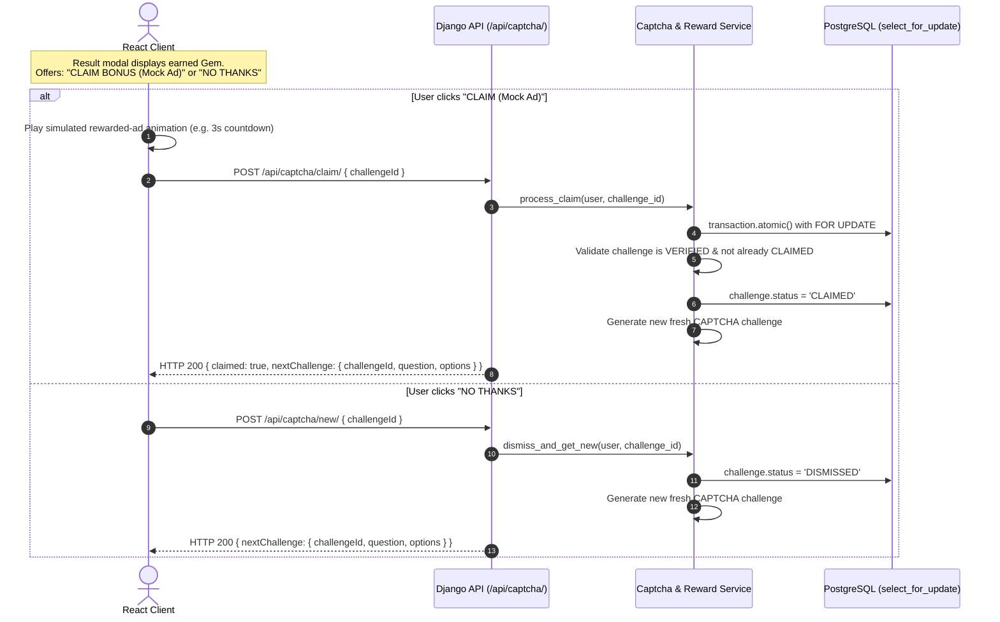

# VELoop CAPTCHA Earn — Migration & Implementation Plan

## Executive Summary

This document establishes the revised, feature-focused migration and implementation blueprint for **VELoop CAPTCHA Earn**. The core scope of this project is to implement the **server-authoritative CAPTCHA Earn system** using **Python, Django, Django REST Framework (DRF), SimpleJWT, and PostgreSQL**, while adapting the existing React + Vite frontend and the existing wallet/ledger foundation.

The existing withdrawal and administrative components are documented for future reference and will **not** block or delay the implementation of CAPTCHA Earn.

---

## 1. Scope & Core Principles

### 1.1 Primary Scope: VELoop CAPTCHA Earn
1. **Core Feature Priority**: CAPTCHA generation, server-side verification, reward crediting (+1.0 Gem for correct, +0.5 Gem for wrong), Claim / No Thanks flow with mock rewarded-ad state, challenge history, and atomic Gem ledger accounting.
2. **Preserve Existing Foundation**: The existing user authentication, wallet balance concept, and append-only ledger transaction models are preserved and migrated from Node/MongoDB to Django/PostgreSQL, adapted to support fractional Gems.
3. **No Premature Complexity**: Payouts and admin withdrawal approvals remain secondary and will not block the CAPTCHA Earn lifecycle.

### 1.2 Core Architectural Principles
- **Server Authoritative**: The frontend never determines correctness, reward amounts, or balances. The correct option is kept strictly server-side.
- **Exact Reward Policy**:
  - **Correct Answer**: `+1.0 GEM`
  - **Wrong Answer**: `+0.5 GEM`
  - Both outcomes credit the user's wallet and write immutable ledger records.
- **Fractional Gem Accounting**: Stored using PostgreSQL `DecimalField(max_digits=14, decimal_places=2)` to ensure precise accounting without floating-point inaccuracies.
- **Zero-Submit Button Interaction**: Clicking an option immediately locks the UI, plays a ~0.5s verification animation, calls the backend, and renders the server-validated state.
- **No Artificial Human Solving Threshold**: Do not reject submissions based on arbitrary minimum completion times (e.g. no 1.5s threshold). Protection is enforced via single-use nonces, expiry TTLs, atomic database locks, user isolation, and rate limiting.
- **Atomic Concurrency Control**: Uses `django.db.transaction.atomic()` and `select_for_update()` to guarantee that concurrent verification attempts or claims cannot double-credit rewards.

---

## 2. CAPTCHA Earn System Design

### 2.1 CAPTCHA Format & Generation Logic
Each challenge consists of:
- **Captcha Text (Question)**: A 6-character alphanumeric string (uppercase English letters and digits, excluding ambiguous glyphs like `0/O` and `1/I` if desired, e.g., `A7K2P9`).
- **Options**: Exactly four (4) options in randomized display order:
  - 1 **Correct Option**: Exactly matches `captcha_text` (e.g., `A7K2P9`).
  - 2 **Similar Wrong Options**: Subtle character swaps or single-glyph alterations that look very similar (e.g., `AJK29P`, `A7L9P2`).
  - 1 **Completely Different Option**: Distinct alphanumeric string (e.g., `X4M8Q1`).
- **Expiry Window**: Configurable TTL (default: 2 minutes / 120 seconds). After expiry, the challenge is marked `EXPIRED` and cannot be verified or rewarded.

### 2.2 Server-Authoritative Security
When the frontend calls `GET /api/captcha/current/`, the server returns:
```json
{
  "success": true,
  "data": {
    "challengeId": "c8f5d023-b14e-4b68-80f4-5f532a2491a1",
    "question": "A7K2P9",
    "options": ["AJK29P", "A7K2P9", "X4M8Q1", "A7L9P2"],
    "expiresAt": "2026-10-05T12:02:00Z",
    "timeRemainingSeconds": 120
  }
}
```
**Critical Rule**: The server response **NEVER** includes `correct_option`, `isCorrect`, or `reward_amount`. The frontend submits `{ "challengeId": "...", "selectedOption": "A7K2P9" }`, and the backend independently determines correctness.

---

## 3. Database Models & Schema Specification

### 3.1 Entity Relationship Diagram



### 3.2 Model Specifications

#### 1. `CaptchaChallenge` (`apps.captcha.models`)
- `id`: `models.BigAutoField` or `models.UUIDField(primary_key=True, default=uuid.uuid4)`
- `challenge_id`: `models.UUIDField(unique=True, default=uuid.uuid4, db_index=True)`
- `user`: `models.ForeignKey(settings.AUTH_USER_MODEL, on_delete=models.CASCADE, related_name='captcha_challenges')`
- `captcha_text`: `models.CharField(max_length=16)` (The target string, e.g. "A7K2P9")
- `options`: `models.JSONField()` (List of 4 string options)
- `correct_option`: `models.CharField(max_length=16)` (Server-only answer)
- `status`: `models.CharField(max_length=20, choices=[('PENDING', 'Pending'), ('VERIFIED', 'Verified'), ('CLAIMED', 'Claimed'), ('DISMISSED', 'Dismissed'), ('EXPIRED', 'Expired')], default='PENDING', db_index=True)`
- `expires_at`: `models.DateTimeField(db_index=True)`
- `selected_option`: `models.CharField(max_length=16, null=True, blank=True)`
- `result`: `models.CharField(max_length=20, choices=[('CORRECT', 'Correct'), ('WRONG', 'Wrong'), ('EXPIRED', 'Expired')], null=True, blank=True)`
- `reward_amount`: `models.DecimalField(max_digits=10, decimal_places=2, null=True, blank=True)` (1.00 or 0.50)
- `reward_status`: `models.CharField(max_length=20, choices=[('PENDING', 'Pending'), ('CREDITED', 'Credited')], default='PENDING')`
- `created_at`: `models.DateTimeField(auto_now_add=True)`
- `completed_at`: `models.DateTimeField(null=True, blank=True)`

#### 2. `CaptchaAttempt` (`apps.captcha.models`)
- `id`: `models.UUIDField(primary_key=True, default=uuid.uuid4)`
- `challenge`: `models.ForeignKey(CaptchaChallenge, on_delete=models.CASCADE, related_name='attempts')`
- `user`: `models.ForeignKey(settings.AUTH_USER_MODEL, on_delete=models.CASCADE, related_name='captcha_attempts')`
- `selected_option`: `models.CharField(max_length=16)`
- `result`: `models.CharField(max_length=20)` (`CORRECT` | `WRONG`)
- `reward`: `models.DecimalField(max_digits=10, decimal_places=2)`
- `status`: `models.CharField(max_length=20)` (`COMPLETED`, `REJECTED`)
- `ip_address`: `models.GenericIPAddressField(null=True, blank=True)`
- `created_at`: `models.DateTimeField(auto_now_add=True)`

#### 3. `Wallet` (`apps.wallets.models`)
- `id`: `models.UUIDField(primary_key=True, default=uuid.uuid4)`
- `user`: `models.OneToOneField(settings.AUTH_USER_MODEL, on_delete=models.CASCADE, related_name='wallet')`
- `gems`: `models.DecimalField(max_digits=14, decimal_places=2, default=Decimal('0.00'))` (Supports +1.0 and +0.5 rewards)
- `ves`: `models.BigIntegerField(default=0)`
- `sves`: `models.BigIntegerField(default=0)`
- `tokens`: `models.BigIntegerField(default=0)`
- `spins`: `models.BigIntegerField(default=0)`
- `updated_at`: `models.DateTimeField(auto_now=True)`

#### 4. `WalletTransaction` (`apps.wallets.models`)
- `id`: `models.UUIDField(primary_key=True, default=uuid.uuid4)`
- `transaction_id`: `models.CharField(max_length=64, unique=True, db_index=True)` (e.g. `TXN_GEM_<uuid>`)
- `user`: `models.ForeignKey(settings.AUTH_USER_MODEL, on_delete=models.CASCADE, related_name='transactions')`
- `wallet`: `models.ForeignKey(Wallet, on_delete=models.CASCADE, related_name='transactions')`
- `currency`: `models.CharField(max_length=10, choices=[('GEM', 'Gems'), ('VE', 'VEs'), ...])`
- `direction`: `models.CharField(max_length=10, choices=[('CREDIT', 'Credit'), ('DEBIT', 'Debit')])`
- `type`: `models.CharField(max_length=40)` (`CAPTCHA_REWARD`, `CAPTCHA_CLAIM`, `ADMIN_CREDIT`, etc.)
- `amount`: `models.DecimalField(max_digits=14, decimal_places=2)`
- `balance_before`: `models.DecimalField(max_digits=14, decimal_places=2)`
- `balance_after`: `models.DecimalField(max_digits=14, decimal_places=2)`
- `source`: `models.CharField(max_length=50, default='CAPTCHA')`
- `reference_id`: `models.CharField(max_length=64, null=True, blank=True, db_index=True)` (Stores `challenge_id`)
- `status`: `models.CharField(max_length=20, default='COMPLETED')`
- `created_at`: `models.DateTimeField(auto_now_add=True, db_index=True)`

---

## 4. End-to-End Operational Flows

### 4.1 Challenge Lifecycle Sequence



### 4.2 Claim Flow & "No Thanks" Sequence



---

## 5. API Specification

All endpoints require standard `Authorization: Bearer <JWT>` header and return the standard JSON envelope.

### 5.1 `GET /api/captcha/current/`
- **Purpose**: Returns the user's currently active, unexpired challenge. If none exists, automatically generates a new one.
- **Response** (`200 OK`):
```json
{
  "success": true,
  "data": {
    "challengeId": "a5e8c139-33b8-4c28-b807-6f8e718b5b60",
    "question": "A7K2P9",
    "options": ["A7L9P2", "A7K2P9", "X4M8Q1", "AJK29P"],
    "expiresAt": "2026-10-05T12:02:00Z",
    "timeRemainingSeconds": 118
  }
}
```

### 5.2 `POST /api/captcha/verify/`
- **Purpose**: Evaluates user selection, updates challenge status, credits Gem reward (+1.0 or +0.5), and writes a ledger entry atomically.
- **Request Body**:
```json
{
  "challengeId": "a5e8c139-33b8-4c28-b807-6f8e718b5b60",
  "selectedOption": "A7K2P9"
}
```
- **Response (`200 OK`)**:
```json
{
  "success": true,
  "data": {
    "challengeId": "a5e8c139-33b8-4c28-b807-6f8e718b5b60",
    "result": "CORRECT",
    "selectedOption": "A7K2P9",
    "rewardAmount": "1.00",
    "currency": "GEM",
    "walletBalance": "101.00",
    "status": "VERIFIED"
  }
}
```
- **Wrong Answer Response (`200 OK`)**:
```json
{
  "success": true,
  "data": {
    "challengeId": "a5e8c139-33b8-4c28-b807-6f8e718b5b60",
    "result": "WRONG",
    "selectedOption": "AJK29P",
    "rewardAmount": "0.50",
    "currency": "GEM",
    "walletBalance": "100.50",
    "status": "VERIFIED"
  }
}
```
- **Error Responses**:
  - `400 Bad Request`: `{ "success": false, "error": { "code": "CHALLENGE_EXPIRED", "message": "Challenge has expired." } }`
  - `409 Conflict`: `{ "success": false, "error": { "code": "ALREADY_VERIFIED", "message": "Challenge has already been submitted." } }`

### 5.3 `POST /api/captcha/claim/`
- **Purpose**: Handles reward confirmation after mock rewarded-ad state. Idempotent. Marks challenge `CLAIMED` and returns next challenge.
- **Request Body**:
```json
{
  "challengeId": "a5e8c139-33b8-4c28-b807-6f8e718b5b60"
}
```
- **Response (`200 OK`)**:
```json
{
  "success": true,
  "data": {
    "claimed": true,
    "nextChallenge": {
      "challengeId": "f90119b4-3a5d-4f81-a982-12059c388277",
      "question": "B3R8W2",
      "options": ["B3R8W2", "B8R3W2", "B3R8M2", "Q9K1V5"],
      "expiresAt": "2026-10-05T12:04:00Z"
    }
  }
}
```

### 5.4 `POST /api/captcha/new/`
- **Purpose**: "No Thanks" action. Dismisses current challenge (marking it `DISMISSED` so it can never be reused) and immediately generates a fresh CAPTCHA.
- **Request Body**:
```json
{
  "challengeId": "a5e8c139-33b8-4c28-b807-6f8e718b5b60"
}
```
- **Response (`200 OK`)**:
```json
{
  "success": true,
  "data": {
    "nextChallenge": {
      "challengeId": "d32b56e1-9f20-410a-85b4-aa12903820fa",
      "question": "M5P2T8",
      "options": ["M5P2T8", "M5P2TS", "N5P2T8", "K1L9Z4"],
      "expiresAt": "2026-10-05T12:04:00Z"
    }
  }
}
```

### 5.5 `GET /api/captcha/history/`
- **Purpose**: Paginated list of past user attempts for audit and progress tracking.
- **Query Params**: `?page=1&limit=20`
- **Response (`200 OK`)**:
```json
{
  "success": true,
  "data": {
    "attempts": [
      {
        "challengeId": "a5e8c139-33b8-4c28-b807-6f8e718b5b60",
        "question": "A7K2P9",
        "selectedOption": "A7K2P9",
        "result": "CORRECT",
        "reward": "1.00",
        "status": "COMPLETED",
        "createdAt": "2026-10-05T12:00:15Z"
      }
    ],
    "pagination": {
      "page": 1,
      "limit": 20,
      "total": 45,
      "totalPages": 3
    }
  }
}
```

### 5.6 `GET /api/wallet/`
- **Purpose**: Fetches current server-authoritative balances.
- **Response (`200 OK`)**:
```json
{
  "success": true,
  "data": {
    "wallet": {
      "gems": "101.50",
      "ves": 25000,
      "sves": 5000,
      "tokens": 500,
      "spins": 3
    }
  }
}
```

---

## 6. Frontend UI/UX Design System & Interactive Specification

### 6.1 Design Language & Aesthetics
- **Theme**: Dark premium fintech aesthetic.
- **Palette**:
  - Background: Deep Navy / True Black (`bg-neutral-950` / `bg-[#0B0F17]`).
  - Cards: Dark Slate with subtle border gradients (`bg-[#121824]`, `border-white/10`).
  - Gem Accent: Rich Metallic Gold / Amber (`text-amber-400`, `bg-amber-400/10`, `border-amber-400/30`).
  - Verifying State: Electric Blue pulse (`border-blue-500`, `bg-blue-500/10`, `ring-2 ring-blue-500/50`).
  - Success State: Vivid Emerald Green (`border-emerald-500`, `bg-emerald-500/15`, `text-emerald-400`).
  - Incorrect State: Vivid Crimson Red (`border-rose-500`, `bg-rose-500/15`, `text-rose-400`).
- **Typography**: Google Fonts Inter / Outfit, high contrast with generous letter tracking for CAPTCHA glyphs.

### 6.2 The Five Major UI States

```
[ State 1: CHALLENGE ]
  Display Question box + 4 interactive Option buttons.
  Countdown timer ticking down to expiry.

       ↓  (User clicks an option - NO submit button)

[ State 2: OPTION SELECTED ]
  Clicked option visually highlighted with active border.

       ↓  (Instant transition, ~0ms)

[ State 3: VERIFYING ]
  All 4 options disabled / locked against clicks.
  Selected option displays subtle pulsing spinner / shimmer (~0.5s duration).
  POST /api/captcha/verify/ executed in background.

       ↓  (Backend response received)

  ┌───────────────────────────────┴───────────────────────────────┐
  ↓                                                               ↓
[ State 4: SUCCESS ]                                            [ State 5: INCORRECT ]
Selected card turns Emerald Green.                              Selected card turns Crimson Red.
Displays: "Correct! +1.00 Gem earned"                           Displays: "Incorrect! +0.50 Gem earned"
Wallet balance increments with tick-up animation.               Wallet balance increments with tick-up animation.
Shows Claim Modal:                                              Shows Claim Modal:
  - "Claim Bonus (Watch Ad)"                                      - "Claim Bonus (Watch Ad)"
  - "No Thanks (Next Captcha)"                                    - "No Thanks (Next Captcha)"
```

### 6.3 Frontend Integration Plan
- Keep existing React + Vite structure.
- In `src/pages/Dashboard.jsx`:
  - Update the "Captcha Tasks" card button from an inert tag to `onClick={() => navigate('/captcha')}`.
- Create new page: `src/pages/CaptchaEarn.jsx`:
  - Embeds the full 5-state CAPTCHA interaction.
  - Displays live Gem balance from `GET /api/wallet/`.
  - Integrates the 0.5s frontend animation before dispatching `api.post('/captcha/verify/')`.
  - Renders the Claim Modal with mock rewarded ad timer (3s) and "No Thanks" action.
- Update `src/App.jsx` to register the `/captcha` route wrapped in `<ProtectedRoute>`.

---

## 7. Security, Anti-Cheat, & Concurrency Protections

1. **Server-Side Answer Secrecy**: The answer is stored only in PostgreSQL. No client inspection, Network DevTools response inspection, or DOM inspection can reveal the correct option.
2. **PostgreSQL Row-Level Locking (`select_for_update`)**:
   - The verification query locks the challenge row:
     ```python
     challenge = CaptchaChallenge.objects.select_for_update().get(challenge_id=challenge_id, user=request.user)
     ```
   - If two verification requests arrive concurrently, the second query waits until the first commits, observes `status == 'VERIFIED'`, and is immediately rejected with `409 ALREADY_VERIFIED`.
3. **Replay & Double-Credit Prevention**:
   - Status changes from `PENDING` $\to$ `VERIFIED` in the same transaction as the `WalletTransaction` credit.
   - Challenge tokens are single-use only.
4. **Challenge Expiration Guard**:
   - Submissions past `expires_at` are rejected with `CHALLENGE_EXPIRED` and receive 0 reward.
5. **Cross-User Isolation**:
   - Every lookup filters strictly on `user=request.user`. A user cannot verify another user's challenge.
6. **Rate Limiting**:
   - DRF rate throttling limits CAPTCHA verification to e.g. 30 requests / minute per IP/user to prevent brute-forcing.

---

## 8. Comprehensive Testing Strategy

A dedicated test suite in `apps/captcha/tests/` will validate the following 15 test scenarios:

| # | Test Scenario | Expected Result |
|---|---|---|
| 1 | **Correct Answer** | Returns `result: "CORRECT"`, credits exactly `+1.00 GEM`, creates `WalletTransaction`, status becomes `VERIFIED`. |
| 2 | **Wrong Answer** | Returns `result: "WRONG"`, credits exactly `+0.50 GEM`, creates `WalletTransaction`, status becomes `VERIFIED`. |
| 3 | **Expired Challenge** | When submitted after `expires_at`, returns HTTP 400 `CHALLENGE_EXPIRED`, 0 reward credited. |
| 4 | **Duplicate Verification** | Re-submitting the same challenge returns HTTP 409 `ALREADY_VERIFIED`, exactly 1 reward credited. |
| 5 | **Duplicate Claim** | Calling `/api/captcha/claim/` twice returns the existing claim, no double reward. |
| 6 | **Fake Reward Tampering** | Client payload attempting to pass `"rewardAmount": 100` is ignored; server calculates reward. |
| 7 | **Fake isCorrect Tampering** | Client payload attempting to pass `"isCorrect": true` is ignored; server checks `selected_option == correct_option`. |
| 8 | **Cross-User Access** | User B attempting to verify User A's `challengeId` returns HTTP 404 / 403 `CHALLENGE_NOT_FOUND`. |
| 9 | **Invalid Challenge ID** | Random UUID returns HTTP 404 `CHALLENGE_NOT_FOUND`. |
| 10 | **Invalid Option String** | Option not present in the challenge options list returns HTTP 400 `INVALID_OPTION`. |
| 11 | **Unauthorized Request** | Requests without valid JWT header return HTTP 401 `AUTHENTICATION_REQUIRED`. |
| 12 | **Concurrent Verification** | Two identical requests sent in parallel via threading/async result in exactly one HTTP 200, one HTTP 409, and exactly one credit in the ledger. |
| 13 | **Rate Limiting** | Exceeding 30 verify calls in 1 minute triggers HTTP 429 `RATE_LIMIT_EXCEEDED`. |
| 14 | **Wallet Balance Update** | Stored `wallet.gems` matches previous balance + `reward_amount`. |
| 15 | **Ledger Transaction Integrity** | `WalletTransaction` row created with accurate `balance_before`, `balance_after`, `type='CAPTCHA_REWARD'`, and `reference_id=challenge_id`. |

---

## 9. Revised 10-Phase Migration Order

The migration proceeds strictly in 10 sequential phases, prioritizing CAPTCHA Earn:

```text
Phase 1: Django + PostgreSQL Foundation
 ├── Setup Django project structure & PostgreSQL database connection
 ├── Configure environment variables (SECRET_KEY, DB settings, CORS)
 ├── Implement custom User model (core.User) matching existing schema
 └── Setup standardized JSON response and exception handling middleware

Phase 2: Authentication + Existing Wallet Integration
 ├── Configure SimpleJWT (login, register, token refresh)
 ├── Port Wallet and WalletTransaction models with DecimalField for Gems
 ├── Implement atomic credit/debit service layer (transaction.atomic + select_for_update)
 └── Expose GET /api/wallet/ with authenticated user balance

Phase 3: CAPTCHA Models + Generator
 ├── Create apps.captcha with CaptchaChallenge and CaptchaAttempt models
 ├── Implement challenge generation service (6-char alphanumeric, 4 options: 1 correct, 2 similar, 1 different)
 ├── Set up 2-minute expiration logic
 └── Expose GET /api/captcha/current/ endpoint

Phase 4: CAPTCHA Verification + Reward + Ledger
 ├── Implement POST /api/captcha/verify/ with row-level locking
 ├── Enforce reward rules (+1.00 Gem for correct, +0.50 Gem for wrong)
 ├── Integrate atomic WalletTransaction ledger write on every verification
 └── Expose GET /api/captcha/history/ for audit history

Phase 5: Claim + No Thanks + New CAPTCHA
 ├── Implement POST /api/captcha/claim/ (idempotent reward claim + fresh CAPTCHA)
 ├── Implement POST /api/captcha/new/ ("No Thanks" dismissal + fresh CAPTCHA)
 └── Ensure old challenges are permanently closed and cannot be re-verified

Phase 6: React API Integration
 ├── Update frontend/src/services/api.js to target Django API base URL
 ├── Implement token refresh interceptor for SimpleJWT
 └── Ensure existing auth context and wallet queries bind seamlessly

Phase 7: CAPTCHA UI Implementation
 ├── Build src/pages/CaptchaEarn.jsx with dark premium fintech design
 ├── Implement the 5 states: CHALLENGE, OPTION SELECTED, VERIFYING, SUCCESS, INCORRECT
 ├── Enforce 0-submit-button interaction with ~0.5s verification animation
 ├── Build Claim Modal with mock rewarded ad countdown (3s) and "No Thanks" action
 └── Link Dashboard "Captcha Tasks" card to /captcha route

Phase 8: Security & Concurrency Testing
 ├── Execute all 15 test scenarios in Django test runner
 ├── Verify concurrent verification race condition immunity
 └── Verify rate limiting and token replay protection

Phase 9: Documentation
 ├── Update API_DOCUMENTATION.md with CAPTCHA endpoints
 ├── Update Database.md with PostgreSQL schema & CaptchaChallenge definitions
 └── Provide updated Postman collection with full CAPTCHA flow

Phase 10: Deployment & Verification
 ├── Validate local end-to-end flow with seeded users
 ├── Prepare Docker / production settings for Django + PostgreSQL
 └── Final smoke verification
```

---
*Revised plan updated on October 5, 2026. Aligned with assignment requirements. Ready for review.*
